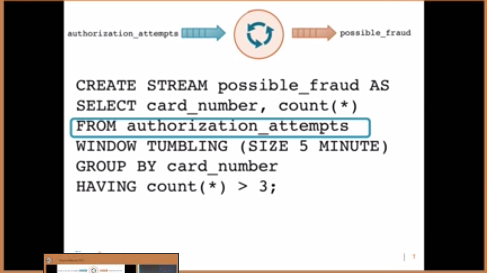

# General information about Kafka

Produce messages on topic `test`

```bash
kafka-console-producer --broker-list localhost:9092 --topic test
```

Consume messages on specific server

```bash
kafka-console-consumer --bootstrap-server localhost:9092 --topic test --from-beginning
```

#### Resources

* [Kafka - Protobuf or Avro](https://medium.com/@felipedutratine/kafka-protobuf-or-avro-178c629b7327)
* [Avro explained](https://www.confluent.io/blog/avro-kafka-data/)
* [Schema evolution in Avro, Protocol Buffers and Thrift](http://martin.kleppmann.com/2012/12/05/schema-evolution-in-avro-protocol-buffers-thrift.html)

##### Other

* [Apache Samza - Stream processing](http://samza.apache.org/)
* [Confluent 6: part series](https://www.confluent.io/blog/data-dichotomy-rethinking-the-way-we-treat-data-and-services/)
* [20 Kafka Best Practices](https://blog.newrelic.com/engineering/kafka-best-practices/)

###### Ongoing

* [Building Event Driven Services with Apache Kafka and Kafka Streams](https://www.youtube.com/watch?v=p9wcx3aTjuo)
  * 


#### Questions

* Are there unique message ids?
* What message format to use?
  * Protobuf
  * Avro
  * JSON
* Format important for KSQL? - [Yes](https://medium.com/@felipedutratine/kafka-protobuf-or-avro-178c629b7327)
* Partition per user?
* How does Kafka handle "pending" messages?
  * Poison queue?